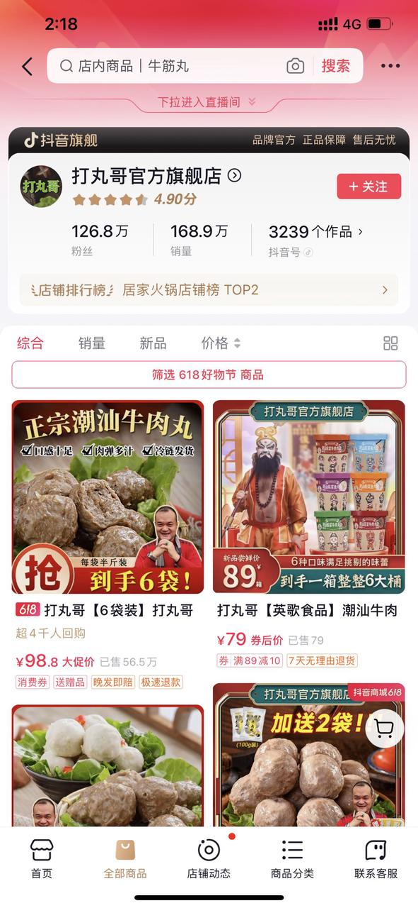
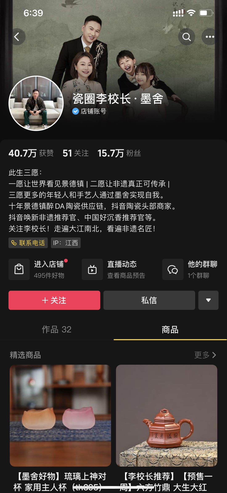

# 写在前面：

> 为什么要做白牌商家分阶段运营白皮书？
>
> 1.明确食饮白牌客户发展阶段，让生意经营从依靠经验到体系化运营
>
> 2.聚焦不同阶段客户经营问题，通过badcase\&goodcase对比解决生意卡点

# 一、白牌商家类型（分型&分阶段）

## 白牌商家分型

### >>白牌分型分布情况

#### 商家分布

> * 食饮Top100白牌客户中人设驱动对比货品驱动比例接近3:7
>
> * 从子行业情况来看，食饮白牌客户主要分布在茶、酒、粮米、零食、生鲜。
>
> * 专业壁垒性越强的行业做人设效果越好。比如茶和酒两个行业。

## 白牌商家阶段划分

### 阶段划分标准

# 二、人设驱动型商家核心卡点

# 三、人设型商家：分阶段核心问题&对应解法

## 0-1初阶商家（打造一个成功的人设号）

### 核心问题1：怎样找到合适的好主播？

| **核心问题**    | **怎样找到合适好主播？**      |                         |                    |
| ----------- | ------------------- | ----------------------- | ------------------ |
| **问题拆解**    | 如何明确主营类目？           | 主播招聘难，怎样找到合适好主播？        | 什么样的主播容易更容易成功？     |
| **badcase** | 盲目挑选类目，不考虑自身情况及类目趋势 | boss直聘高价找模板化带货主播，缺乏行业经验 | 个性平庸，缺乏人格魅力，表演能力一般 |

具体怎么做？以实际客户案例进行剖析

**Step1：明确主营类目（看潜力）**

* 方式1：通过自身供应链优势或周边产业带情况，明确主营类目

* 方式2：根据大盘近期高增速高占比类目，明确主营类目

| 达人昵称   | 玺泉茶业                                                             | 草原太平哥                                                            | 打丸哥                                                              | 小尹有好茶                                                            | 小鹿茶叶                                                             |
| ------ | ---------------------------------------------------------------- | ---------------------------------------------------------------- | ---------------------------------------------------------------- | ---------------------------------------------------------------- | ---------------------------------------------------------------- |
| 前期主营类目 | 花草茶                                                              | 牛肉干                                                              | 牛肉丸                                                              | 白茶                                                               | 绿茶                                                               |
| 店铺截图   |  |  |  |  |  |
| 筛选思路   | 自有线下茶类店铺                                                         | 自有牛肉干品牌                                                          | 洞察趋势+潮汕产业带                                                       | 供应链优势类目                                                          | 供应链优势类目                                                          |

**Step2：多渠道灵活寻找适配主播（有行业背景优先）**

* 老板转型：原类目线下老板转型打造人设号。

* 从业人员：前往各类目源头产业带，寻找行业多年从业人员。

* 孵化期达人：抖音垂类类目孵化期达人（3K-20K不到粉丝量）建联商谈合作。

| 找谁     | 老板转型                                                               |                                                                    |                                                                    | 从业人员                                                               | 孵化期达人                                                              |
| ------ | ------------------------------------------------------------------ | ------------------------------------------------------------------ | ------------------------------------------------------------------ | ------------------------------------------------------------------ | ------------------------------------------------------------------ |
| 主播来源渠道 | 类目线下老板转型或找到有合作意向老板、厂长合作                                            |                                                                    |                                                                    | 行业峰会、产业带、同行介绍、招聘网站                                                 | 星图平台筛选、第三方平台其他平台类目定向筛选                                             |
| 过往身份职业 | 茶叶店铺老板娘                                                            | 牛肉干品牌创始人                                                           | 潮汕牛肉丸店老板                                                           | 茶行业从业人员                                                            | 人设号孵化阶段达人                                                          |
| 主播头像   |  |  |  |  |  |

**Step3：优质好主播的共通点（特质要突出）**

* 外型有亲和力：外在形象要求正向，要有亲和力。颜值高有气质可以额外加分

* 行业认知度高：需要对行业有充足的了解认知。能够向观众进行行业赋能

* 表达能力够强：表达足够流利，叙事有趣，风趣幽默可以额外加分

* 表演能力丰富：面对镜头淡定自若，不紧张。肢体语言及表情丰富，节目效果强可额外加分

* 极具个性有魅力：拥有自己的喜怒哀乐和价值观，能够给到粉丝共鸣知己的感觉

| 主播头像    |  |  |  |  |  |
| ------- | ---------------------------------------------------------------- | ---------------------------------------------------------------- | ---------------------------------------------------------------- | ------------------------------------------------------------------ | ---------------------------------------------------------------- |
| 外型有亲和力  | 甜美有气质                                                            | 阳光正直硬朗                                                           | 和蔼可亲接地气                                                          | 可爱温柔略带调皮                                                           | 随和亲切笑容温暖                                                         |
| 行业认知度高  | 多年卖茶泡茶经验                                                         | 多年放牧，自有工厂                                                        | 自有线下牛肉丸店铺                                                        | 多年制茶泡茶经验                                                           | 多年收茶泡茶经验                                                         |
| 表达能力强   | 东北口音表达快准狠                                                        | 标准普通话表达沉稳中气十足                                                    | 广东普通话表达清晰流利                                                      | 标准普通话表情丰富，表述可爱                                                     | 略带口音普通话表达清晰流利                                                    |
| 表演能力强   | 擅长营造氛围感                                                          | 面对镜头淡定自若                                                         | 肢体语言丰富                                                           | 擅长故事情节类演绎                                                          | 擅长故事情节类演绎                                                        |
| 极具个性有魅力 | 独立自主不靠男人                                                         | 注重感情重义气                                                          | 开朗大方不做作                                                          | 细心体贴爱调皮                                                            | 开朗实诚                                                             |

### 核心问题2：怎样做好人设账号定位？

| **核心问题**    | **怎样做好人设账号定位？** |                  |                      |                           |
| ----------- | --------------- | ---------------- | -------------------- | ------------------------- |
| **问题拆解**    | 如何找到主播人设亮点？     | 货品怎么跟人设结合？       | 对比头部账号是否具备差异亮点？      | 账号主页如何装修？                 |
| **badcase** | 虚假伪造假人设形象人设崩塌快  | 售卖货品与人设关联度低人群不精准 | 直接照搬头部账号内容人设同质化严重难起量 | 账号名称无体现人设IP个人简介内容口号化，不够真实 |

**具体怎么做？以实际客户账号为例进行拆解**

**Step1：主播特质剖析（六问）**

**——拆解主播的性格经历，将亮点融入自身人设中。**

| 人设：一个少数民族牧民，自创牛肉干品牌。是一个直爽豪气真诚的草原汉子，说话会比较直接爱憎分明。拥有 |   |   | **主播是什么人？**    | 少数民族牧民，曾创建过自己的牛肉干品牌。曾因牛肉干被央视采访过——亮点1：将过往经历转为人设履历，作为信任背书    |
| ------------------------------------------------------------------------- | - | - | -------------- | ---------------------------------------------------------- |
|                                                                           |   |   | **主播的形象特点？**   | 日常以少数民族穿着为主——亮点2：视频内容及日常直播中突出主播形象亮点，塑造亲近阳光形象               |
|                                                                           |   |   | **主播的性格特点？**   | 直爽豪气真诚——亮点3：视频内容及直播突出主播独特性格，找到受众粉丝                         |
|                                                                           |   |   | **主播有啥特长爱好？**  | 骑马射箭放牧——亮点4：主页内容上可以发布相关日常内容，强化人设形象，让人设更丰满                  |
|                                                                           |   |   | **主播有没有地域优势？** | 我居住在内蒙古大草原，有天然场景优势——亮点5：借助独有的天然场景优势，在视频内容或直播场景上多体现，凸出人设真实性 |
|                                                                           |   |   | **主播有什么缺点？**   | 说话直接，爱憎分明——一个可以接受的缺点能让人设更加饱满，完美的人设并不利于持久运营                 |

**Step2：货品竞争力剖析（五问）**

**——拆解货品优劣势及受众客群**

|  |   |   | **我能找到什么货品？** | 牛肉干是我的核心品类，同时还有各类内蒙特产。如奶豆腐，奶条，牛蹄筋等——这些货品跟我的主播人设是否匹配 |
| ------------------------------------------------------------------------------------------------ | - | - | ------------- | --------------------------------------------------- |
|                                                                                                  |   |   | **货品供应模式？**   | 自有牧场&自有工厂——能否快速开新品或包装调整，根据市场情况随时调整库存？               |
|                                                                                                  |   |   | **货品具有什么优势？** | 产品质量高用料上等，曾经被央视官媒采访——卖点重点突出                         |
|                                                                                                  |   |   | **货品具有什么劣势？** | 原料成本较高，对比售价相对竞品要高——避开同类账号优势出，杨长避短                   |
|                                                                                                  |   |   | **对应客群画像？**   | 高消费水平人群，如新锐白领、资深中产、精锐妈妈——话术内容围绕受众群体打造调整，让人设与货品结合    |

**Step3：vs竞对账号找差异化亮点**

**——拆解竞对账号情况，找到差异化打法及优势。**

**Step4：四步明确主播人设定位**

**——总结汇总上述拆解信息，明确主播人设，并于个人简介中体现**

|  | **我是谁？**        | ——昵称：草原太平哥（牛肉干）——人设：牛胖胖牛肉干品牌创始人——籍贯：来自内蒙古——经历：被官媒多次曝光 |
| ------------------------ | --------------- | ----------------------------------------------------- |
|                          | **我要干什么事情？**    | ——卖什么：我要卖正宗高品质牛肉干——人设升华：分享内蒙美好生活                      |
|                          | **我能给你带来什么？**   | ——绝对保真：我卖的是牛肉干中的爱马仕                                   |
|                          | **我的核心目标人群画像？** | 男性为主，新锐白领等高消费人群，三线以上城市，广东省曾经买到劣质牛肉干喜欢吃零食的受众群体。        |

### 核心问题3：如何打造账号主页内容吸引粉丝？

| **核心问题**    | **如何打造账号主页内容** |                              |                         |
| ----------- | -------------- | ---------------------------- | ----------------------- |
| **问题拆解**    | **账号主页装修**     | **主页视频选题**                   | **如何保证素材产出**            |
| **badcase** | 账号定位模糊无法体现人设重点 | 主页内容过硬           点赞低、难以获取新粉丝 | 缺乏原生软性内容创作能力素材团队仅1个剪辑同学 |

##### Step1：**账号设计：充分**凸显人设定位，昵称、头像、封面风格整体保持一致

| **账号主页装修** |                                                                                          |                          |
| ---------- | ---------------------------------------------------------------------------------------- | ------------------------ |
| **账号昵称**   | **头像/头图**                                                                                | **封面**                   |
| 如：晚晚的茶话馆   |  |  |

##### **主页内容：**降低营销属性，持续发布强人设相关原生内容

| **主页内容（视频属性/选题）**                                                            |                                                                          |                                                    |
| ---------------------------------------------------------------------------- | ------------------------------------------------------------------------ | -------------------------------------------------- |
| **主播形象类（20%）**（核心对人设进行补充）                                                    | **货品/品类（70%）**（核心对商品进行种草）                                                | **供应链介绍（10%）**（核心对供应链实力进行宣传）                       |
|            颜值类（女生人设居多）日常生活vlog（突出人设真实性）主播创业剧情故事（突出人设真实性）人设公众形象传播（完善人设）...... | 主推商品干货讲解（软性种草）货品知识科普（软性种草）品类溯源实景（种植、养殖）品类原材料解析（凸显质量）货品使用场景带入（促达痛点）...... | 工厂生产工艺（商品质量）工厂/品牌规模优势（价格优惠原因）源头工厂实景（干净整洁可信赖）...... |

##### **保供给：**要有完整的素材团队，保证素材稳定持续供给（至少要1个拍摄1个剪辑）

后续可根据素材实际需求or盈利情况拓展团队配置

|          | **素材团队配置**               |                          |                          |
| -------- | ------------------------ | ------------------------ | ------------------------ |
| **阶段**   | **初创期（冷启期）**（低成本保证供给）    | **成长期**（拓宽素材方向）          | **成熟期**（多投放模式，多矩阵号差异化）   |
| **人员配置** | 2人配置                     | 小规模团队1+3人配置              | 高阶配置（多人设矩阵配置）            |
| **素材产能** | 每周3-5条                   | 每天1条                     | 每天3-5条                   |
| **分工模式** |  |  |  |

## 1-10发展期商家（丰富品类关注新老粉增长）

### 核心问题1：品类单一影响生意滞涨

| **核心问题**    | **品类单一**         |            |                     |
| ----------- | ---------------- | ---------- | ------------------- |
| **问题拆解**    | **无选品团队、无拓品思路**  | **缺乏新品货源** | **垂类账号，不敢拓品**       |
| **badcase** | 老板一人拍板，无团队成员调研市场 | 拓展新品供应链困难  | 粉丝受众受限单一类目，强行拓品导致掉粉 |

**怎么丰富货品类目？**

**1）选品：专人专事**

**关注市场趋势进行选品**

**选品四方向**

**2）缺乏新品货源**

优先前往产业带寻找源头厂家进行合作，或向销售同学or电商小二同学寻求帮助

**3）单号拓品**

垂类达人拓展品类时需要谨慎，强硬切换品类容易导致老粉脱粉，导致GMV下滑

可在切入新品类前，通过短视频内容打造热点，为自己拓宽新品类属性。如某普洱茶客户

### 核心问题2：新粉GMV占比低，拉新困难

| **核心问题**    | **新粉GMV占比低，拉新困难**       |                    |                          |                                   |
| ----------- | ----------------------- | ------------------ | ------------------------ | --------------------------------- |
| 问题拆解        | 素材样式单一                  | 玩法单一               | 投放产品单一                   | 上新单一                              |
| **badcase** | 为方便直播过品及减少素材费用，仅使用直播间直投 | 常年独自直播，缺乏与其他达人合作互动 | 为方便直播间拿量，通常使用千川竞价投放通投拉满。 | 部分人设商家上新品同质化严重，多为同一类目重复上卖点价格相似产品。 |

**素材样式单一：**

> 大部分达人商家在投放时均以直播间直投为主，在直播间场景无特别吸睛能力时，难以吸引新粉。
>
> 投放视频引流到直播间可通过完整的内容种草打动新粉，更容易在直播间完成转化。

通过不同老粉占比客户发现，新粉占比低客户普遍不重视竖版视频。主要以直播间直投为主

> 可以帮助拉新的引流短视频素材长什么样？
>
> 时长60秒：充足时长能够更加软性讲解产品，通过丰富内容打动消费者。
>
> 趣味性强：视频内容中多为完整故事线，讲述故事的同时完成内容种草
>
> 弱化营销：视频中不提产品价格，营销属性较低，主要通过使用感受侧面分享进行产品讲解
>
> 信任感强：以营造信任为主线内容更容易完成新粉转化，视频中提前针对消费者购买的问题进行解答，

**玩法单一：**

> 有部分人设型商家专注于营造自己人设号，缺乏与其他达人合作。

**优秀商家如何通过丰富玩法完成破圈拉新？**

* 玩法1：视频合拍。通过共同出镜参加视频创作，并发布在两个达人主页互相引流。

* 玩法2：达人进直播间。提前预热并通过达人进直播间带货形式帮助完成粉丝拉新破圈

* 玩法3：达人连麦。通过短时间连麦发放超级福袋或实物福袋，吸引双方粉丝进入停留

明星达人合拍x达人进直播间

连麦玩法

怎样找到合适的达人合作？

| 方式一                                                                                                                                                                                                                                                              | 方式二                                                                                                                                                                                                                                                              | 方式三                          |
| ---------------------------------------------------------------------------------------------------------------------------------------------------------------------------------------------------------------------------------------------------------------- | ---------------------------------------------------------------------------------------------------------------------------------------------------------------------------------------------------------------------------------------------------------------- | ---------------------------- |
| 行业头部带货达人如：交个朋友、三只羊、大Logo、陈浩洋                                                                                                                                                                                                                                     | 关联类目达人如：茶关联类目瓷器相关达人，                                                                                                                                                                                                                                             | 人群包反选达人**星图或云图进行生成人群包反选达人，** |
|  |  |       |

**上新单一：**

> 部分人设商家上品同质化严重，多为同一类目重复上卖点价格相似产品。导致老粉占比持续上涨
>
> 想通过上新拓展新人群，我们需要关注新品是否新品类，卖点是否新卖点，价格是否能打动不同的新人群

人设天花板商家是怎么做的？

Step1：先看行业不同节点趋势品类，根据品类趋势进行选品

Step2：洞察用户需求，参考市场定价组货，持续上新品类

Step3：根据商品客单分布情况，找到缺失价格带对应人群

**持续上新很重要：**每一个新品类产品在上新前期都能带来大量新粉GMV，随着上品时间流逝。老粉GMV占比会持续上升

[小青柑](https://local-data.dash.bytedance.net/dashboard?fission=661a1808ff01a4025bbffd06\&id=344154\&query-id=6661a5d45ed997022f5888f4)

[早C晚A](https://local-data.dash.bytedance.net/dashboard?fission=661a1808ff01a4025bbffd06\&id=344154\&query-id=6661a6645ed997022f58890b)

[陈皮白茶](https://local-data.dash.bytedance.net/dashboard?fission=661a1808ff01a4025bbffd06\&id=344154\&query-id=6661a72d5ed997022f58892c)

**多品类售卖很重要：**每一个品类产品都有独立的人群，各产品之间人群重复度不足30%

**投放单一：**

> 投放上粉丝GMV占比高商家，多以千川竞价收割类产品为主，缺乏拉新产品尝试

「新客定向」

新客定向是什么？

新客定向怎么用？

新客定向客户案例

「看播任务」

看播任务是什么？

看播任务结合其他大场产品如feedslive/直播加热等，在拉升GMV同时进行稳定拉新

看播任务达人客户案例

### 核心问题3：老粉囤货过多，生意面临瓶颈，如何通过大场突破？

| **核心问题**    | 老粉囤货过多，生意面临瓶颈，如何通过大场突破？       |
| ----------- | ----------------------------- |
| **badcase** | 常年以平播为主，缺乏节点大场或自制大场。生意长时间缺乏增长 |

**李陌茶：通过内容直播大场，刺激老粉消费完成破圈拉新，突破生意瓶颈。**

2周1小场，1月1大场，每次的大场都有不同的玩法主体，让用户有新鲜感

**人设客户做大场怎么玩？**

**Step1：选好时间节点**

**类型A   规律定期型**

**类型B   特殊时间点**

类型C 电商节日节点

* **按周来**

*每周X晚8点定期开播*

* **按月来**

*每月逢8（8号/18号/28号）*

* **按季来**

*3-4月份春夏换季*

* 9-10月份秋冬换季*

* **公司纪念日**

*办公室乔迁日*

*公司周年庆*

*品牌创始日*

* **创始人纪念日**

*老板生日会*

*结婚纪念日（情侣CP）*

* 电商节点

*年中大促618*

*双11*

*双12*

* 节日节点

*端午节/年货节*

*中秋节/情人节*

**Step2：选好大场主题**

预热内容以及直播内容需要围绕大场主题来制定

| **主****题**           |                                                |                                                  |                                                  |                                                |
| -------------------- | ---------------------------------------------- | ------------------------------------------------ | ------------------------------------------------ | ---------------------------------------------- |
| **主****题****参****考** |                                                |                                                  |                                                  |                                                |
| **营销****节奏**         | **时间节点**指定特殊日期**节点周期**一季度1次                    | **时间节点指定特殊日期****节点周期**一年2次                       | **时间节点**定期上新（如：每月逢8上新，8号18号28号）**节点周期**每周/每月/每季度 | **时间节点根据节日节点确定****节点周期一年4-5次**                 |
| **案****例****参****考** |  |  |  |  |

**Step3：提前规划筹备物料**

| **分工类型** | **项目统筹与执行**         | **内容规划**                   | **投放媒介方案**       | **直播间规划**      | **货品策略**                |
| -------- | ------------------- | -------------------------- | ---------------- | -------------- | ----------------------- |
| 分工内容     | 明确各个职能部门分工，统筹整体项目进展 | 配合Bigday活动，进行活动前、活动中传播内容细化 | 品牌和竞价侧的投放规划及预算分配 | 做好当天直播Bigday规划 | 根据GMV目标拆解货品售卖政策以达到利润最大化 |
| 核心关注点    |                     |                            |                  |                |                         |

**Step4：规划大场福利活动**

| **相关因素**   |                                                                                                                             | **建议与解析**                                                                         | **实例举例**                           |
| ---------- | --------------------------------------------------------------------------------------------------------------------------- | --------------------------------------------------------------------------------- | ---------------------------------- |
|            |                                                                                                                             |                                                                                   |                                    |
| **活动设置**   | 达人直播间福利/活动设置                                                                                                                | 奖品：建议选择硬通货产品（苹果华为茅台）或与售卖品类强相关噱头产品可选择市面当前通用型产品，如：iphone、华为等...抽奖时间：定时抽奖+随机抽奖保证观看停留 | 达人出场期间抽奖活动设置：由主达人抽奖送出iphone、手表、平板等 |
|            |                                                                                                                             |                                                                                   | 定时抽奖，送出Iphone、华为等                  |
| **直播互动工具** |                                                                                                                             |                                                                                   |                                    |
| **智能优惠券**  | [ 巨量千川-直播智能优惠券商家权益方案（对外）](https://bytedance.larkoffice.com/docx/doxcnezN4LalAY8oIg9KkeYZRUb)这个都是大场必用的工具，其他达人的达成智能优惠券渗透率90%+ |                                                                                   |                                    |

**Step5：提前做好投放规划**

把每一分钱都用在刀刃上

|            |                     |                    |               |                       |          |
| ---------- | ------------------- | ------------------ | ------------- | --------------------- | -------- |
| **产品名称**   | **闭环开机位**           | **Feedslive**      | **看播任务**      | **直播加热**              | **千川竞价** |
| **投放目的**   | 放大活动声量，为大场蓄水，快速引导进店 | 持续稳定提供流量，提前锁定确定性流量 | 提前锁定互动人群，助力拉新 | 达人进场/Top主播、高转化率时段快速拉人 | 提供转化人群   |
| **投放比例参考** | 5%                  | 10%                | 5%            | 10%                   | 70%      |
| **投放时段**   | 核心转化时段              | 核心转化时段             | 核心转化时段        | 达人进场前30min～1h         | 大场全天     |

## 10-100成熟期商家：（培育品牌自播开启第二增长曲线）

### 核心问题：生意过于依赖达人，生意能否增长过于依赖达人能力，如何拿到更大增量？

| **核心问题**    | **生意过于依赖达人，如何通过品牌自播开启第二增长曲线**   |                          |                                         |
| ----------- | ------------------------------- | ------------------------ | --------------------------------------- |
| **badcase** | 达人直播时长每天只能维持4-5小时，无法通过拉时长放大生意规模 | 电商政策调整，导致达人直播内容受限，生意持续低迷 | 生意核心来源来自达人，一但达人账号被封禁限流或跳槽中止合作都会导致集团生意崩盘 |

**解法：人设账号外，开设品牌自播号，1+1 or 1+N模式**

人设x品牌旗舰店

人设x日不落直播间

人设x单品自播间

人设x抖音超市

**品牌自播号如何打造？——以某人设零食客户为例**

**客户背景**

> **某人设零食客户**-**23年全网GMV破3亿。在抖音主要靠着人设账号带货，目前粉丝数达400万。**

**开启品牌自播成果**

顽皮老板23-24年达人号GMV与品牌自播间持续增长，目前单月GMV稳定4000万。

达人账号GMV占比持续下滑，23年12月-2月达人GMV下跌明显。日不落直播间完成兜底

**打造品牌自播号，他们是怎么做的？**

**账号主页**

* 人设号：头像突出人设身份。主页核心突出我是谁？我要做什么？我能给你带来什么？

* 品牌自播号：头像突出品牌logo。主页核心突出品牌号与人设号关联。

主人设号

品牌自播号

品牌自播号

品牌自播号

**主页视频：**

* 人设号：整体内容偏软性，无剪辑，主打一镜到底。内容核心是种草引流。

* 品牌自播号：各类混剪为主，营销属性较重，主打优惠福利。内容核心是爆款收割

人设号

品牌自播号1

品牌自播号2

品牌自播号3

**货品玩法：**

* 所有直播间共用同一货盘，通过达人号测试新品成功后，放到品牌自播号进行收割。

* 每个品牌自播号以主推爆品作为区隔，通过达人测试成功话术模版进行持续收割。

ps（品类丰富的商家朋友可以类目进行自播号区隔）

[超模神器](https://local-data.dash.bytedance.net/dashboard?fission=6638b1dfb962a70318cabb79\&id=344154\&query-id=665985dde47105023f0529fa)

[雪山海盐芝士](https://local-data.dash.bytedance.net/dashboard?fission=6638b1dfb962a70318cabb79\&id=344154\&query-id=6659860e5ed997022f57bf75)

[牧场干酪](https://local-data.dash.bytedance.net/dashboard?fission=6638b1dfb962a70318cabb79\&id=344154\&query-id=66598582e47105023f0529de)

**主播及场景：**

主播：人设号主播仅达人进行开播。品牌自播号主播无需行业经验，有表达能力直播经验即可

场景：品牌自播号场景高度还原人设号，同时放上达人肖像板明确与达人号关系。

人设号：直播过款为主

品牌自播号1：直播主推碱水贝果款

品牌自播号2：直播主推牧场干酪款

**产品头图&落地页：**

统一颜色风格，塑造品牌视觉锤。核心突出品牌名称与产品卖点

**直播时间：**

人设号：不定期开播，开播时间集中晚上黄金时段，开播时长短，仅1-2小时。

品牌自播号：每天坚持开播，开播时间从早上8点开始，直播时长16小时。通过拉升直播时长提升收割效率

人设号开播时间

人设号直播时长

品牌自播号开播时间

品牌自播号直播时长

# 三、白牌人设驱动型商家运用指南（OP）

